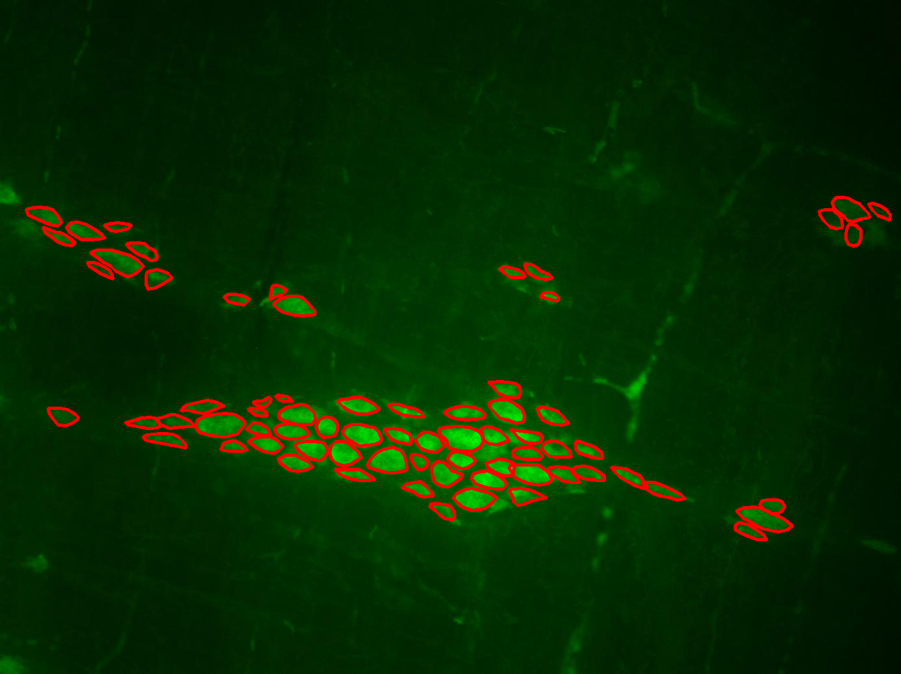

# ENSeg: A Novel Dataset and Method for the Segmentation of Enteric Neuron Cells on Microscopy Images
[![CC BY-NC-SA 4.0][cc-by-nc-sa-shield]][cc-by-nc-sa]

<div style="text-align: center;">
    
</div>

Repository containing the source code used for obtaining the results described in the article `ENSeg: A Novel Dataset and Method for the Segmentation of Enteric Neuron Cells on Microscopy Images`.

## Abstract
> The Enteric Nervous System (ENS) is a dynamic field of study where researchers devise sophisticated methodologies to comprehend the impact of chronic degenerative diseases on Enteric Neuron Cells (ENCs). These investigations demand labor-intensive effort, requiring manual selection and segmentation of each well-defined cell to conduct morphometric and quantitative analyses. However, the scarcity of labeled data and the unique characteristics of such data limit the applicability of existing solutions in the literature. To address this, we introduce a novel dataset featuring expert-labeled ENC called ENSeg, which comprises 187 images and 9709 individually annotated cells. We also introduce an approach that combines automatic instance segmentation models with Segment Anything Model (SAM) architectures, enabling human interaction while maintaining high efficiency. We employed YOLOv8, YOLOv9, and YOLOv11 models to generate segmentation candidates, which were then integrated with SAM architectures through a fusion protocol. Our best result achieved a mean DICE score (mDICE) of 0.7877, using YOLOv8 (candidate selection), SAM, and a fusion protocol that enhanced the input point prompts. The resulting combination protocols, demonstrated after our work, exhibit superior segmentation performance compared to the standalone segmentation models. The dataset comes as a contribution to this work and is available to the research community.

## ENSeg Dataset Overview

This dataset represents an enhanced subset of the [ENS dataset](https://link.springer.com/article/10.1007/s11063-022-11114-y). The ENS dataset comprises image samples extracted from the enteric nervous system (ENS) of male adult Wistar rats (*Rattus norvegicus*, albius variety), specifically from the jejunum, the second segment of the small intestine. 

The original dataset consists of two classes:
- **Control (C)**: Healthy animals.
- **Walker-256 Tumor (WT)**: Animals with cancer induced by the Walker-256 Tumor.

Image acquisition involved **13 different animals**, with **7 belonging to the C class** and **6 to the WT class**. Each animal contributed **32 image samples** obtained from the myenteric plexus. All images were captured using the same setup and configuration, stored in **PNG format**, with a spatial resolution of **1384 × 1036 pixels**. The overall process of obtaining the images and performing the morphometric and quantitative analyses takes approximately **5 months**.


### Dataset Annotations

Our dataset version includes expert-annotated labels for **6 animals**, tagged as **2C, 4C, 5C, 22WT, 23WT, and 28WT**. The image labels were created by members of the same laboratory where the images originated: researchers from the **Enteric Neural Plasticity Laboratory of the State University of Maringá (UEM)**. 

Annotations were generated using [LabelMe](https://labelme.io/) and consist of polygons marking each neuron cell. To maintain labeling quality according to laboratory standards, only neuron cells with **well-defined borders** were included in the final label masks. The labeling process lasted **9 months** (from **November 2023 to July 2024**) and was iteratively reviewed by the lead researcher of the lab.

### Dataset Format and Usage

The dataset is made available in the LabelMe format. For each image, a JSON file is made available contaning the following keys:

- `animalTag`: Identifier for the animal from which the image was taken (e.g., 2C, 4C, 5C, 22WT, 23WT, 28WT).
- `imageId`: Unique identifier for the image within the dataset.
- `label`: General label for the image, indicating the condition of the animal. "0" i used for Control and "1" for Walker-256 Tumor.
- `labelName`: "C" for Control and "TW" for Walker-256 Tumor.
- `numCells`: Number of annotated neuron cells in the image.
- `imagePath`: Name used for saving the image.
- `imageHeight`: Height of the image in pixels.
- `imageWidth`: Width of the image in pixels.
- `shapes`: List of annotated shapes (polygons) marking each neuron cell in the image.
    - `label`: Label for the annotated shape (i.e., "enc").
    - `numPoints`: Number of points defining the polygon.
    - `points`: List of (x, y) coordinates defining the polygon.
- `imageData`: Base64-encoded string of the image data.

The generated files were adapted for training and evaluating segmentation models. For instance segmentation models based on **point-coordinate generation** (e.g., YOLOv8), a list of **(x, y) points per object**, normalized by the image’s original height and width, is required for training.

### Dataset Statistics

After processing, the full dataset contains:  
- **187 images**  
- **9,709 annotated neuron cells**  

The table below summarizes the number of images and annotated neurons per animal tag.

| Animal Tag | # of Images | # of Neurons |
|------------|------------|--------------|
| 2C         | 32         | 1590         |
| 4C         | 31         | 1513         |
| 5C         | 31         | 2211         |
| 22WT       | 31         | 1386         |
| 23WT       | 31         | 1520         |
| 28WT       | 31         | 1489         |
| **Total**  | **187**    | **9709**     |

### Recommended Training Methodology

Due to the limited number of animal samples and the natural split of images, we recommend using a **leave-one-out cross-validation (LOO-CV) method** for training. This ensures more reliable results by performing **six training sessions per experiment**, where:
- In each session, images from one subject are isolated for testing.
- The remaining images are used for training.

Although **cross-validation is recommended**, it is **not mandatory**. Future works may introduce new training methodologies as the number of annotated subjects increases. However, **it is crucial to maintain images from the same source (animal) within the same data split** to prevent biased results. Even though samples are randomly selected from the animals' original tissues, this approach enhances the credibility of the findings.

---

This dataset provides a valuable resource for **instance segmentation** and **biomedical image analysis**, supporting research on ENS morphology and cancer effects. Contributions and feedback are welcome!

## Dependency installation
To run the here presented source codes, it is required that the user has the `seg-lib` library installed on version `1.0.4`:

```bash
pip install seg-lib==1.0.4
```

More details on the installation process may be found on the README.md file contained to the root of [seg-lib repository](https://github.com/gustavozf/seg-lib).

## Project Setup
First, download the dataset from one of the sources:
- [HuggingFace](https://huggingface.co/datasets/gustavozf/enseg)
- [Kaggle](https://www.kaggle.com/datasets/gustavozanonifelipe/enseg-dataset)
- [Zenodo](https://zenodo.org/records/14834973)
- [paperswithcode](https://paperswithcode.com/dataset/enseg)

Place it under a directory (`$DATA_PATH`). As mentioned previously, the dataset is made available in the LabelMe format. To use it for training the YOLO models, the following script may be used for converting them to the target format:

```bash
DATA_PATH=/path/to/data/labelme/format/ANIMAL_TAG
OUTPUT_PATH=/path/to/output

python ../../tools/labelme_2_yolov8.py \
    --input-path $DATA_PATH/ANIMAL_TAG \
    --output-path $OUTPUT_PATH/data/ANIMAL_TAG \
    --mode seg
```

Then, download the disired SAM models and place them on the same directory (`$SAM_MODELS_PATH`). The used weights may be downloaded from their original repositories:

- [SAM](https://github.com/facebookresearch/segment-anything)
- [SAM 2](https://github.com/facebookresearch/sam2)
- [SAM-Med2D](https://github.com/OpenGVLab/SAM-Med2D)

Lastly, clone the [seg-lib](https://github.com/gustavozf/seg-lib) repository and run the scripts available in the `projects/enseg-dataset` directory.

## Running the Scripts
The following script are available, in order to reproduce the obtained results:
- `train_yolo_seg.py`: Script to train YOLO segmentation models using the ENSeg dataset. It prepares the data, configures the model, and initiates the training process for each target YOLO architecture for segmentation.
- `evaluate_sam.py`: Script to evaluate the performance of SAM models on the ENSeg dataset. It loads the trained SAM models and computes segmentation metrics.
- `evaluate_fusion.py`: Script to evaluate the fusion protocol combining YOLO and SAM models. It integrates the outputs from both models, following the four proposed fusion protocols, and assesses the overall segmentation performance.

An example on how to run these files may be seen at `run.sh`.

## Project Citation
If you want to cite our article, the dataset, or the source codes contained in this repository, please used the citation (bibtex format):

```
@Article{felipe25enseg,
    AUTHOR = {
        Felipe, Gustavo Zanoni
        and Nanni, Loris
        and Garcia, Isadora Goulart
        and Zanoni, Jacqueline Nelisis
        and Costa, Yandre Maldonado e Gomes da},
    TITLE = {ENSeg: A Novel Dataset and Method for the Segmentation of Enteric Neuron Cells on Microscopy Images},
    JOURNAL = {Applied Sciences},
    VOLUME = {15},
    YEAR = {2025},
    NUMBER = {3},
    ARTICLE-NUMBER = {1046},
    URL = {https://www.mdpi.com/2076-3417/15/3/1046},
    ISSN = {2076-3417},
    DOI = {10.3390/app15031046}
}
```

## Additional Notes
Please check out our previous datasets if you are interest into developing projects with Enteric Nervous System images:
1. [EGC-Z](https://github.com/gustavozf/EGC_Z_dataset): three datasets of Enteric Glial cells images, composed of three different chronic degenerative diseases: Cancer, Diabetes Mellitus, and Rheumatoid Arthritis. Each dataset represent binary classification task, with the classes: control (healthy) and sick;
2. [ENS](https://github.com/gustavozf/ENS_dataset): the ENS image datasets comprises 1248 images taken from thirteen rats distributed in two classes: control/healthy or sick. The images were created with three distinct contrast settings targeting different Enteric Nervous System cells: Enteric Neuron cells, Enteric Glial cells, or both.

For more details, please contact the main author of this project or create an issue on the project.

## License 
This work is licensed under the [Creative Commons Attribution-NonCommercial-ShareAlike 4.0 International License][cc-by-nc-sa].

That means that you can:
* **Share** — copy and redistribute the material in any medium or format
* **Adapt** — remix, transform, and build upon the material

under the following terms:
* **Attribution** — You must give appropriate credit, provide a link to the license, and indicate if changes were made. You may do so in any reasonable manner, but not in any way that suggests the licensor endorses you or your use.
* **NonCommercial** — You may not use the material for commercial purposes.
* **ShareAlike** — If you remix, transform, or build upon the material, you must distribute your contributions under the same license as the original.

[![CC BY-NC-SA 4.0][cc-by-nc-sa-image]][cc-by-nc-sa]

[cc-by-nc-sa]: http://creativecommons.org/licenses/by-nc-sa/4.0/
[cc-by-nc-sa-image]: https://licensebuttons.net/l/by-nc-sa/4.0/88x31.png
[cc-by-nc-sa-shield]: https://img.shields.io/badge/License-CC%20BY--NC--SA%204.0-lightgrey.svg